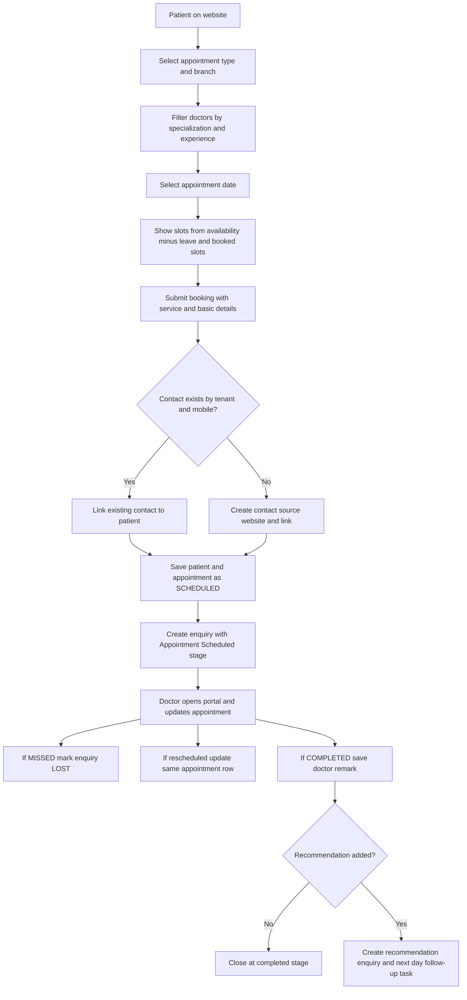

# Hospital appointment booking (Plan)

## New tables

### `doctor`
- `id`, `tenant_id`, `branch_id`
- `name`, `specialization`, `degree`, `experience_years`
- `licence_no`, `mobile_no`
- `walk_in_fee`, `telephony_fee`
- `user_id` (nullable, links to CRM user for doctor portal login)
- `active`, `created_at`, `updated_at`

### `doctor_availability`
- `id`, `doctor_id`, `tenant_id`
- `appointment_type` (`PHYSICAL`, `TELEPHONY`)
- `day_of_week` (1-7)
- `start_time`, `end_time`
- `slot_minutes`
- `active`

### `doctor_leave`
- `id`, `doctor_id`, `tenant_id`
- `leave_date`
- `appointment_type` (nullable; if null then block both appointment types)
- `reason` (optional)

### `patient`
- `id`, `tenant_id`, `contact_id`
- `full_name`, `dob`, `gender`, `email`, `mobile`
- `username`, `password_hash`
- `created_at`, `updated_at`
- Unique constraints: (`tenant_id`, `mobile`) and (`tenant_id`, `username`)

### `appointment`
- `id`, `contact_id`, `patient_id`, `doctor_id`, `tenant_id`, `branch_id`
- `appointment_type` (`PHYSICAL`, `TELEPHONY`)
- `appointment_date`, `slot_start`, `slot_minutes`
- `service_description`
- `status` (`SCHEDULED`, `COMPLETED`, `MISSED`)
- `doctor_remark`, `doctor_recommendation`
- `created_at`, `updated_at`

Notes:
- Availability is generated from weekly schedule minus leave and booked slots.
- Reschedule uses the same appointment row; status remains `SCHEDULED`.

## Existing tables to change

### `enquiry`
- Add nullable `appointment_id`.
- Booking enquiry stores this appointment id.
- Recommendation enquiry can also store the same appointment id.

### `task`
- Add nullable `linked_enquiry_id`.
- Used for recommendation follow-up tasks tied to a specific enquiry.
- Existing `assignee_id` remains required.

### `stage`
- No schema change required.
- Add tenant-specific stages:
  - `Appointment Scheduled` (`is_closed = 0`)
  - `Consultation Completed` (`is_closed = 1`)
- For missed appointments, use existing Lost stage.

### `contact`
- No schema change required.
- Match by (`tenant_id`, `phone`):
  - If found: link to `patient.contact_id`
  - If not found: create new contact with `source = website`

## Flow

1. Patient opens hospital website appointment page.
2. Patient selects appointment type (`PHYSICAL`/`TELEPHONY`) and branch.
3. System shows doctors by branch with filters (specialization, experience).
4. Patient selects date; system shows valid slots from:
   - Weekly doctor availability
   - Minus doctor leave
   - Minus already booked `SCHEDULED` slots
5. Patient selects slot, enters service/basic details, and books appointment.
6. System checks contact in same tenant by mobile:
   - If exists: link contact to patient
   - If not exists: create contact (`source = website`) and link
7. System saves patient and appointment (`SCHEDULED`).
8. System creates enquiry for the appointment with stage `Appointment Scheduled` and stores `appointment_id`.
9. Doctor logs in to portal and updates appointment outcome:
   - `MISSED`: mark appointment missed and enquiry lost
   - `SCHEDULED` + date/slot change: reschedule same appointment row
   - `COMPLETED`: save doctor remark
10. If recommendation exists on completed appointment:
   - Mark booking enquiry as completed stage
   - Create a new recommendation enquiry
   - Create follow-up task for next day linked to that recommendation enquiry

## Out of this draft

- Final mapping for `course_id` on appointment enquiry.
- Final owner-assignment logic (`owner_id`) for appointment enquiry.
- Final follow-up task assignee strategy (`assignee_id`).
- SMS/email confirmation workflow after booking.
- Online fee payment collection flow.
- Multi-branch assignment support for a single doctor.
